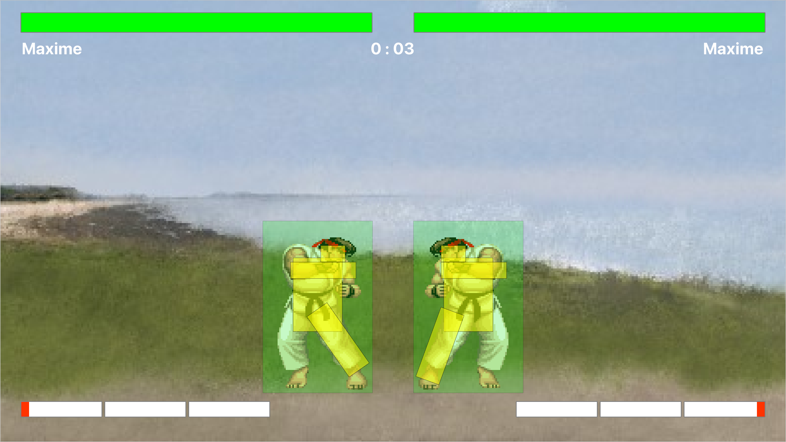

# IUT Fighter

## Name
IUT FIGHTER

## Description
Street fighter 2 based game, with the people of the IUT of La Rochelle as fighters.

## Visuals
**Start Menu :**

**Main menu (gamemode selection) :**

**Controls customization menu :**

**Fighters selection menu :**

**Fight example + displaying fighter's hitbox :**

## Installation
You just need to compile the project with Qt and install the font in the "font" folder for a better game experience.

## Usage
Have fun !

## Roadmap
We are currently working on tests, adding sound and improving hitbox.

## Contributing
We are not open to contribution for the moment.

## Authors and acknowledgment
DIARD Arthur  
ADAMEC Anthony  
BONNARD Cyril  
PHILIPPE Noah  
BODIN Maxime  
GALLOUX Nils  

## License
Canard source project.

## Project status
V1.3 is done !!

